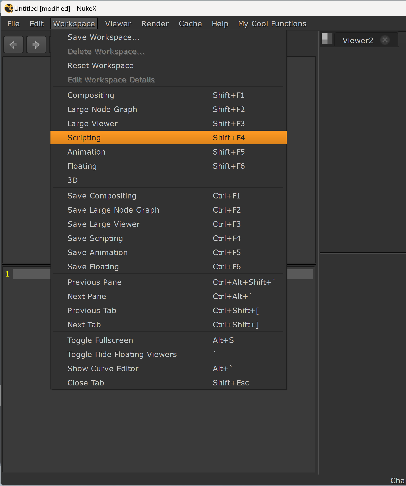
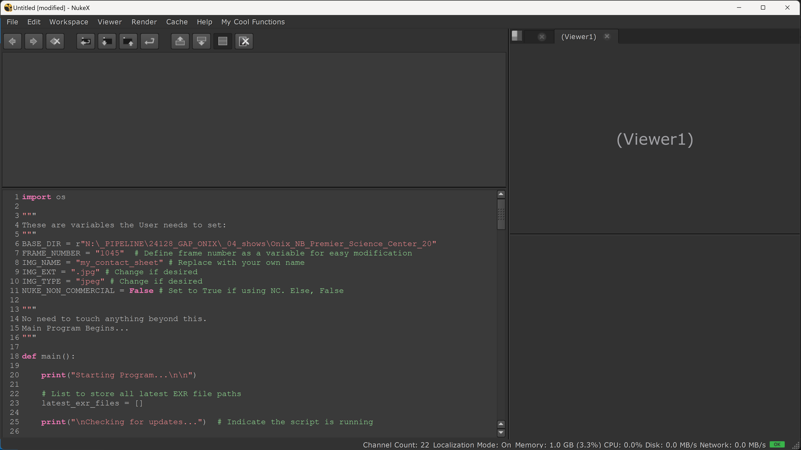
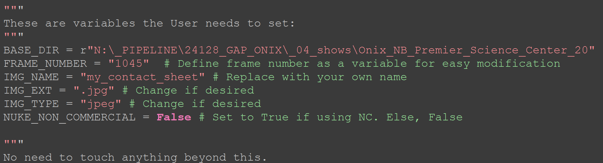
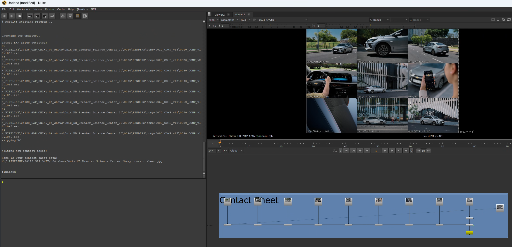
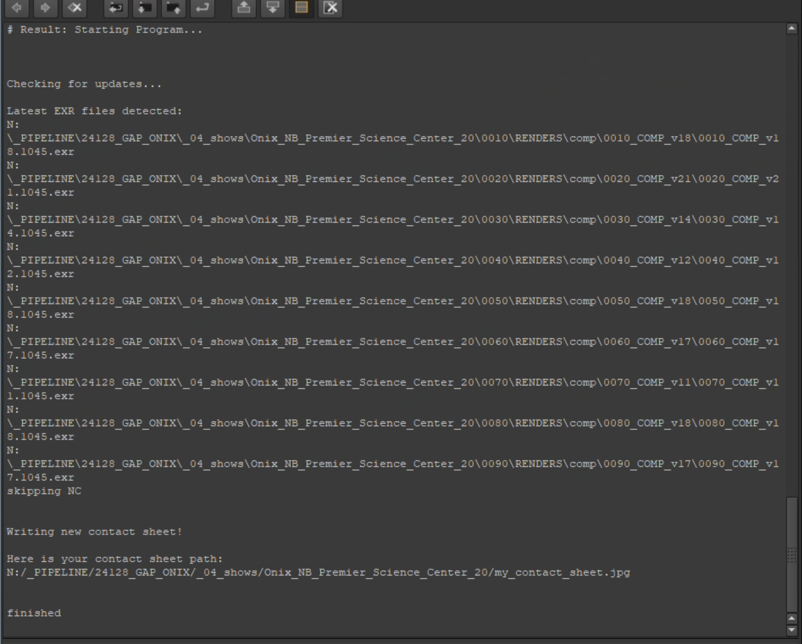
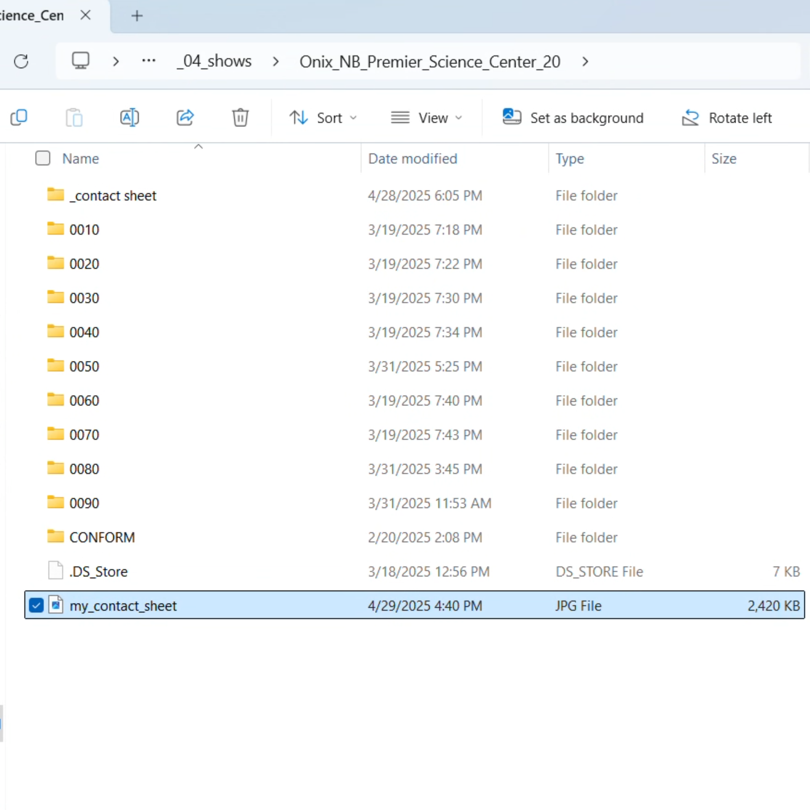

# "CS_Gen" Contact Sheet Generator

This tool is meant to help streamline the creation of contact sheets for a specified spot or show.
It will look through a specified show directory, look through all the shots and find the latest 
rendered versions, then create a nuke script and render out a jpg (or any image type) of the contact 
sheet to the same root show directory. 

Here's how it works:

## Step 1. 
Open an empty Nuke scene.

## Step 2. 
Set the workspace to "Script Editor" or otherwise navigate to the Script Editor in Nuke.

## Step 3. 
In a separate text editor, like Notepad, open CS_Gen_4AFX.py

## Step 4. 
Select All, and Copy the contents of CS_Gen_4AFX.py

## Step 5. 
Paste the contents into the Script Editor in Nuke.

## Step 6. 
Scroll to the top and find the user variables, in all caps at the top of the script.
These variable can be changed, such as IMG_NAME, which is going to be the name of the
jpg that is output. Ex: My_Contact_Sheet, or Music_Store_CS.

The most important variable, however, is the BASE_DIR, which is the base directory 
for the desired spot or show. Copy and paste the desired path.

## Step 7. 
Simply hit the "Run the current script" button, or Ctrl+Return as a hotkey to run the program.

## Step 8. 
You're done! You should see a node tree in your node graph neat and tidy, and there should be
a jpg file in the same place as your BASE_DIR.

